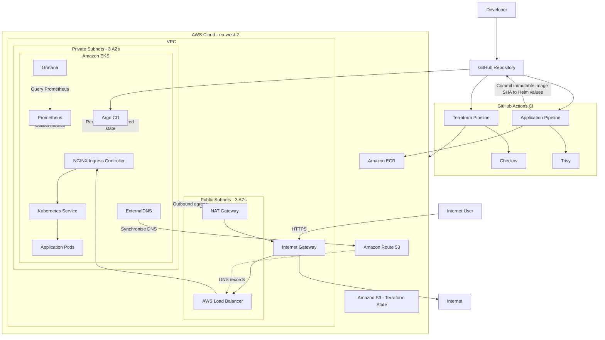

# Amazon EKS Platform — Terraform, Kubernetes, GitOps & CI/CD

<p align="center">
  <strong>A production-style Kubernetes platform on AWS demonstrating infrastructure as code, secure CI/CD, GitOps delivery, automated DNS/TLS, workload hardening, and full-stack observability.</strong>
</p>

<p align="center">
  <a href="https://eks.abdimajidcloud.com"><strong>Live App</strong></a> ·
  <a href="https://argocd.abdimajidcloud.com"><strong>Argo CD</strong></a> ·
  <a href="https://prometheus.abdimajidcloud.com"><strong>Prometheus</strong></a> ·
  <a href="https://grafana.abdimajidcloud.com"><strong>Grafana</strong></a>
</p>

<p align="center">
  
  
  
  
  
  
  
  
  
  
  
  
  
</p>

---

## Executive Summary

This repository is an end-to-end DevOps / Platform Engineering project built around **Amazon EKS**. The goal was not simply to deploy a container to Kubernetes, but to design and operate the surrounding platform: networking, identity, infrastructure automation, delivery pipelines, GitOps reconciliation, DNS, TLS, security controls, monitoring, and repeatable cluster lifecycle management.

The platform is provisioned with **Terraform**, runs workloads on **private EKS worker nodes**, stores application images in **Amazon ECR**, and separates persistent bootstrap resources from disposable cluster infrastructure. **GitHub Actions** performs CI and security scanning, while **Argo CD** owns continuous delivery into Kubernetes using Helm-based desired state stored in Git.

The current platform exposes four HTTPS endpoints when the environment is running:

| Endpoint | Purpose |
|---|---|
| [`eks.abdimajidcloud.com`](https://eks.abdimajidcloud.com) | Public 2048 application |
| [`argocd.abdimajidcloud.com`](https://argocd.abdimajidcloud.com) | GitOps control plane and application health |
| [`prometheus.abdimajidcloud.com`](https://prometheus.abdimajidcloud.com) | Prometheus metrics and query interface |
| [`grafana.abdimajidcloud.com`](https://grafana.abdimajidcloud.com) | Kubernetes observability dashboards |

> **Note:** These endpoints are available while the EKS environment is running. The project is designed so the EKS environment can be destroyed and rebuilt while persistent bootstrap resources such as Terraform state and ECR remain intact.

---

## Quick Navigation

### See It Working
- [Platform Demo](#platform-demo)
- [Live Endpoints](#live-endpoints)
- [GitOps Evidence](#gitops-evidence)
- [Observability Evidence](#observability-evidence)

### Understand the Platform
- [Architecture](#architecture)
- [Traffic Flow](#application-traffic-flow)
- [Networking](#networking)
- [Amazon EKS](#amazon-eks)
- [DNS & TLS](#dns--tls)
- [Repository Structure](#repository-structure)

### Understand Delivery
- [CI/CD Overview](#cicd-overview)
- [Terraform Pipeline](#pipeline-1--terraform-infrastructure)
- [Application Pipeline](#pipeline-2--application-ci)
- [GitOps with Argo CD](#gitops-with-argo-cd)
- [Helm Deployment Model](#helm-deployment-model)

### Understand Security & Operations
- [Security Model](#security-model)
- [Kubernetes Workload Hardening](#kubernetes-workload-hardening)
- [Monitoring & Observability](#monitoring--observability)
- [Resilience & Health Checks](#resilience--health-checks)
- [Challenges & Troubleshooting](#challenges--troubleshooting)

### Engineering Context
- [Key Engineering Decisions](#key-engineering-decisions)
- [Validation Checklist](#validation-checklist)
- [Known Limitations & Next Iteration](#known-limitations--next-iteration)
- [What I Learned](#what-i-learned)
- [Interview Talking Points](#interview-talking-points)

---

# Platform Demo

The application is deployed through the complete platform path rather than directly from a local machine. The demo below shows the live application running through the EKS ingress layer.


### What this demo represents

```text
Developer change
      ↓
GitHub
      ↓
GitHub Actions
      ↓
Build + security scanning
      ↓
Amazon ECR
      ↓
Helm desired state updated in Git
      ↓
Argo CD detects change
      ↓
Amazon EKS
      ↓
NGINX Ingress
      ↓
HTTPS application
```

---

# Live Endpoints

The platform uses a single DNS zone, `abdimajidcloud.com`, with dedicated subdomains for the application and operational tooling.

| Service | URL | How it is exposed |
|---|---|---|
| Application | `https://eks.abdimajidcloud.com` | NGINX Ingress + ExternalDNS + cert-manager |
| Argo CD | `https://argocd.abdimajidcloud.com` | NGINX Ingress + ExternalDNS + cert-manager |
| Prometheus | `https://prometheus.abdimajidcloud.com` | NGINX Ingress + ExternalDNS + cert-manager |
| Grafana | `https://grafana.abdimajidcloud.com` | NGINX Ingress + ExternalDNS + cert-manager |

This means the operational tooling can be accessed through real HTTPS hostnames instead of relying on temporary `kubectl port-forward` sessions.

---

# Architecture

The platform separates **infrastructure provisioning**, **application CI**, **GitOps delivery**, **runtime traffic**, and **observability**.



### Architecture highlights

- **Region:** AWS `eu-west-2`
- **Amazon EKS:** Kubernetes `1.35`
- **Availability:** VPC spans **3 Availability Zones**
- **Worker placement:** EKS managed node group runs in **private subnets**
- **Ingress:** internet-facing AWS load balancer fronts **NGINX Ingress Controller**
- **Private egress:** private workloads use **one NAT Gateway** for outbound connectivity
- **Persistent bootstrap layer:** S3 remote state and ECR survive normal cluster teardown
- **GitOps:** Argo CD reconciles application and platform components from declarative sources
- **Observability:** kube-prometheus-stack provides Prometheus and Grafana

---

## Application Traffic Flow

It is important to separate **DNS resolution** from the actual network traffic path.

### DNS resolution

```text
Browser requests eks.abdimajidcloud.com
              ↓
Amazon Route 53 resolves the hostname
              ↓
AWS Load Balancer address
```

### Request path

```text
Internet User
     ↓ HTTPS
AWS Load Balancer
     ↓
NGINX Ingress Controller
     ↓
Kubernetes ClusterIP Service
     ↓
2048 Application Pods
```

The Kubernetes `Deployment` manages the pods, but traffic does **not** pass through the Deployment object itself. The `Service` provides the stable internal endpoint used to reach healthy pods.

---

# Tech Stack

| Area | Technology | Role in the platform |
|---|---|---|
| Cloud | AWS | Hosts networking, EKS, ECR, Route 53, IAM and state storage |
| Kubernetes | Amazon EKS | Managed Kubernetes control plane and worker orchestration |
| Infrastructure as Code | Terraform | Provisions AWS resources and EKS infrastructure |
| Containers | Docker | Packages the application into an immutable runtime image |
| Registry | Amazon ECR | Stores versioned application images |
| Package Management | Helm | Templates Kubernetes application resources |
| GitOps | Argo CD | Continuously reconciles desired state into EKS |
| CI/CD | GitHub Actions | Automates Terraform and application build workflows |
| Ingress | NGINX Ingress Controller | Routes host-based traffic into Kubernetes |
| DNS | Route 53 + ExternalDNS | Automates DNS record lifecycle from Kubernetes |
| TLS | cert-manager + Let's Encrypt | Automates certificate issuance and renewal |
| Monitoring | Prometheus | Scrapes and stores Kubernetes metrics |
| Visualisation | Grafana | Displays cluster CPU, memory and workload metrics |
| Container Security | Trivy | Blocks HIGH / CRITICAL image vulnerabilities |
| IaC Security | Checkov | Reports Terraform misconfiguration findings |
| AWS CI Identity | GitHub OIDC | Provides short-lived AWS credentials to Actions |
| Pod AWS Identity | EKS OIDC / IRSA | Gives ExternalDNS scoped AWS access without static keys |
| Workload Security | NetworkPolicy + ServiceAccount | Restricts pod networking and Kubernetes identity |

---

# Repository Structure

```text
eks-project/
├── .github/
│   └── workflows/
│       ├── terraform.yaml                 # Infrastructure pipeline
│       └── application.yaml               # Application CI pipeline
│
├── app/
│   ├── Dockerfile                         # NGINX Alpine runtime image
│   ├── index.html
│   ├── favicon.ico
│   ├── js/
│   ├── meta/
│   └── style/
│
├── docs/
│   └── images/
│       ├── platform-demo.gif              # README application demo
│       ├── argocd.png                     # GitOps evidence
│       ├── prometheus.png                 # Metrics evidence
│       └── grafana.png                    # Observability evidence
│
├── helm/
│   └── eks-2048/
│       ├── Chart.yaml
│       ├── values.yaml                    # Immutable image tag + runtime config
│       └── templates/
│           ├── deployment.yaml
│           ├── service.yaml
│           ├── ingress.yaml
│           ├── networkpolicy.yaml
│           └── serviceaccount.yaml
│
├── k8s/
│   ├── clusterissuer.yaml
│   ├── clusterissuer-production.yaml
│   ├── argocd-ingress.yaml
│   ├── prometheus-ingress.yaml
│   ├── grafana-ingress.yaml
│   ├── external-dns-application.yaml
│   └── monitoring-application.yaml
│
├── scripts/
│   ├── bootstrap-cluster.sh               # Installs/reconciles platform components
│   └── destroy-cluster.sh                 # Safe cluster teardown
│
└── terraform/
    ├── bootstrap/                          # Persistent S3 state + ECR
    ├── environments/
    │   └── prod/                           # Production-style EKS environment
    └── modules/                          # Reusable Terraform modules
        └── iam/
            ├── eks/                       # EKS IAM dependencies
            └── external-dns/              # IRSA / Route 53 permissions
```

> The exact module directory set may evolve as the project is refactored, but the key design remains the same: persistent bootstrap resources are isolated from the disposable EKS environment, and IAM dependencies are separated to avoid Terraform dependency cycles.

---

# Infrastructure

## Networking

The platform is built on a custom VPC spanning **three Availability Zones**.

### Public layer

The public network layer contains internet-facing components, including:

- Internet Gateway
- NAT Gateway
- Public subnets across three AZs
- Internet-facing AWS load balancer created for ingress traffic

### Private layer

EKS worker nodes are placed in private subnets so they do not require direct inbound internet exposure.

Private workloads that need outbound internet connectivity follow:

```text
Private subnet
     ↓
NAT Gateway
     ↓
Internet Gateway
     ↓
Internet
```

This gives worker workloads outbound access for tasks such as image pulls and package retrieval while keeping the worker layer away from direct public ingress.

## Amazon EKS

Terraform provisions the major EKS components:

- EKS control plane
- Managed node group
- Cluster IAM role
- Node IAM role
- Security groups
- OIDC integration
- Managed cluster add-ons

The cluster uses Kubernetes `1.35` with a managed node group configured with a desired capacity of two worker nodes and scaling boundaries around that baseline.

### Managed add-ons

The following EKS add-ons are represented explicitly in infrastructure as code:

- **VPC CNI** — pod networking
- **CoreDNS** — internal Kubernetes DNS
- **kube-proxy** — Kubernetes service networking

This avoids treating core cluster networking components as invisible implementation details.

---

# Persistent Bootstrap Infrastructure

Not every resource should be destroyed when the EKS environment is torn down.

The project therefore separates persistent bootstrap resources from the cluster environment:

```text
Bootstrap layer
├── Amazon S3 → Terraform remote state
└── Amazon ECR → Application container images

Disposable EKS environment
├── VPC networking
├── IAM integrations
├── EKS control plane
├── Managed node group
├── Ingress platform
├── Monitoring platform
└── Application workloads
```

### Why this matters

If the EKS environment is destroyed and rebuilt:

- Terraform state remains available.
- Existing ECR images are not unintentionally deleted.
- Infrastructure can be reconstructed from source.
- The project has a clearer lifecycle boundary between persistent and replaceable resources.

---

# Docker

The application is served from an **NGINX Alpine** container.

```dockerfile
FROM nginx:alpine

RUN apk upgrade --no-cache

COPY index.html /usr/share/nginx/html/
COPY favicon.ico /usr/share/nginx/html/
COPY js /usr/share/nginx/html/js
COPY meta /usr/share/nginx/html/meta
COPY style /usr/share/nginx/html/style

EXPOSE 80
```

### Container design decisions

- **Small runtime image:** `nginx:alpine`
- **Restricted COPY:** only runtime application assets are copied
- **Package patching:** Alpine packages are upgraded during build
- **Immutable image tags:** every image is tagged with the Git commit SHA
- **No fake multi-stage build:** the application is static HTML/CSS/JavaScript and has no compile stage, so adding a builder image would add complexity without meaningful benefit

---

# CI/CD Overview

The project deliberately separates **infrastructure CI/CD** from **application CI**.

```text
                       GitHub
                      /      \
                     /        \
        Terraform changes    Application changes
               ↓                    ↓
      Terraform Pipeline      Application Pipeline
               ↓                    ↓
          AWS / EKS          Build + Scan + ECR
                                     ↓
                           Update Helm desired state
                                     ↓
                                  Argo CD
                                     ↓
                                  Amazon EKS
```

This separation limits blast radius and makes the responsibility of each pipeline easier to reason about.

---

## Pipeline 1 — Terraform Infrastructure

The Terraform workflow is scoped to infrastructure changes and performs:

```text
Checkout
   ↓
Terraform Setup
   ↓
GitHub OIDC → AWS IAM Role
   ↓
terraform fmt -check
   ↓
terraform init
   ↓
terraform validate
   ↓
terraform plan
   ↓
terraform apply
```

### OIDC authentication

GitHub Actions does not store long-lived AWS access keys. Instead, the workflow requests a GitHub OIDC token and exchanges it for short-lived credentials through an AWS IAM role.

The trust relationship is restricted to the repository and `main` branch subject used by the project.

### Why this is preferable

- No static AWS access key in GitHub Secrets
- Short-lived credentials
- Repository / branch trust restrictions
- Easier credential lifecycle management

---

## Pipeline 2 — Application CI

The application pipeline performs the build-and-release preparation path:

```text
Checkout repository
       ↓
Checkov Terraform scan
       ↓
GitHub OIDC → AWS
       ↓
ECR Login
       ↓
Docker Build
       ↓
Trivy HIGH / CRITICAL scan
       ↓
Push image to Amazon ECR
       ↓
Update Helm values.yaml image tag
       ↓
Commit desired state to Git
       ↓
Argo CD reconciles deployment
```

### Immutable image tagging

Images use:

```text
${{ github.sha }}
```

instead of `latest`.

That produces a traceable chain:

```text
Git Commit SHA
      ↕
ECR Image Tag
      ↕
Helm values.yaml
      ↕
Kubernetes Deployment
```

### Pipeline security behaviour

- **Trivy** is a blocking gate for `HIGH` and `CRITICAL` vulnerabilities.
- **Checkov** scans Terraform configuration and reports infrastructure security findings.
- The current Checkov step is advisory (`soft_fail`) rather than a hard deployment gate, which is documented as a future hardening opportunity.

---

# GitOps with Argo CD

Argo CD owns continuous delivery into Kubernetes. GitHub Actions does **not** deploy the application directly with `kubectl`.

The application release path is:

1. Developer pushes a change.
2. GitHub Actions builds the Docker image.
3. Trivy scans the image.
4. The image is pushed to ECR using the Git SHA as the tag.
5. GitHub Actions updates the Helm image tag in Git.
6. Argo CD detects the desired-state change.
7. Argo CD renders the Helm chart.
8. Argo CD synchronises the cluster.
9. Kubernetes rolls the workload to the new image.

### Argo CD reconciliation behaviour

The application uses:

- **Automated sync**
- **Self-healing**
- **Pruning**

This makes Git the source of truth for the application desired state.

## Platform components under Argo CD

Argo CD is not limited to the application. It also manages major Kubernetes platform components:

| Argo Application | Source | Purpose |
|---|---|---|
| `eks-2048` | This repository / custom Helm chart | Application workload |
| `external-dns` | ExternalDNS Helm repository | Automated Route 53 record management |
| `monitoring` | Prometheus Community Helm repository | kube-prometheus-stack |

ExternalDNS still receives AWS permissions through Terraform-managed IAM / IRSA, while Argo CD owns the Kubernetes Helm release. This creates a useful ownership boundary:

```text
Terraform
   ↓
AWS IAM + IRSA identity

Argo CD
   ↓
ExternalDNS Kubernetes release
```

---

# GitOps Evidence

All three Argo CD applications are shown as **Healthy** and **Synced** through the custom HTTPS Argo CD endpoint.


This screenshot demonstrates:

- Argo CD reachable over `argocd.abdimajidcloud.com`
- `eks-2048` healthy and synced
- `external-dns` healthy and synced
- `monitoring` healthy and synced
- no degraded applications
- no out-of-sync applications

---

# Helm Deployment Model

The application is packaged as a custom Helm chart under `helm/eks-2048`.

The chart manages:

- Deployment
- Service
- Ingress
- ServiceAccount
- NetworkPolicy
- CPU / memory requests and limits
- Readiness probe
- Liveness probe
- Image repository and immutable image tag

This avoids duplicating near-identical raw Kubernetes manifests and gives the GitOps flow a single configurable source for workload deployment.

---

# DNS & TLS

DNS and TLS are automated rather than manually maintained.

## ExternalDNS

ExternalDNS watches Kubernetes ingress resources and synchronises the required DNS records into Amazon Route 53.

Current ExternalDNS configuration includes:

- Provider: AWS
- Domain filter: `abdimajidcloud.com`
- Policy: `sync`
- Registry: TXT
- TXT owner ID: `eks-project`
- ServiceAccount: externally managed for IRSA

This means a hostname declared in Kubernetes can be reconciled into Route 53 without manually copying load balancer addresses.

## cert-manager

cert-manager requests and renews public certificates from **Let's Encrypt**.

The production ClusterIssuer is:

```text
letsencrypt-production
```

Ingress resources declare the hostname and TLS secret; cert-manager performs the ACME challenge and stores the issued certificate as a Kubernetes Secret.

### Current HTTPS endpoints

```text
https://eks.abdimajidcloud.com
https://argocd.abdimajidcloud.com
https://prometheus.abdimajidcloud.com
https://grafana.abdimajidcloud.com
```

---

# Security Model

Security controls exist across AWS identity, CI, container build, Kubernetes identity, pod networking, and application runtime.

## AWS / CI Identity

### GitHub Actions → AWS

GitHub Actions uses **OIDC** to assume AWS IAM roles rather than storing static AWS access keys.

### ExternalDNS → AWS

ExternalDNS uses **IRSA** through the EKS OIDC issuer to receive scoped Route 53 permissions.

These are two different trust paths:

```text
GitHub OIDC
   ↓
AWS IAM role for CI
```

and:

```text
EKS OIDC / IRSA
   ↓
AWS IAM role for ExternalDNS pod
```

Keeping those concepts separate is an important part of the platform's identity design.

---

## Kubernetes Workload Hardening

The application workload includes several security controls.

### Dedicated ServiceAccount

The application uses its own ServiceAccount:

```text
eks-2048
```

and disables automatic API token mounting:

```yaml
automountServiceAccountToken: false
```

This reduces unnecessary Kubernetes API credentials inside the application pod.

### Prevent privilege escalation

The container security context includes:

```yaml
securityContext:
  allowPrivilegeEscalation: false
```

An earlier attempt to apply more aggressive Linux capability removal broke NGINX runtime behaviour. The final control set was chosen based on actual runtime validation rather than keeping a security setting that made the application unusable.

### NetworkPolicy

A Kubernetes NetworkPolicy restricts application ingress so that traffic is expected through the `ingress-nginx` namespace on TCP port 80.

The control was validated by confirming:

- normal website traffic through NGINX continued to work
- direct pod-IP access was blocked

This makes the policy a tested control rather than a YAML-only claim.

---

# Resilience & Health Checks

The application defines CPU / memory controls and both readiness and liveness probes.

## Resource requests and limits

```yaml
resources:
  requests:
    cpu: 50m
    memory: 32Mi
  limits:
    cpu: 200m
    memory: 128Mi
```

Requests help the scheduler make placement decisions, while limits place an upper bound on runtime resource consumption.

## Readiness probe

```yaml
readinessProbe:
  httpGet:
    path: /
    port: 80
  initialDelaySeconds: 5
  periodSeconds: 5
  timeoutSeconds: 3
  failureThreshold: 3
```

The readiness probe answers:

> **Should Kubernetes send traffic to this pod?**

## Liveness probe

```yaml
livenessProbe:
  httpGet:
    path: /
    port: 80
  initialDelaySeconds: 15
  periodSeconds: 10
  timeoutSeconds: 5
  failureThreshold: 3
```

The liveness probe answers:

> **Should Kubernetes restart this container?**

---

# Monitoring & Observability

The platform uses **kube-prometheus-stack**, which deploys Prometheus, Grafana and supporting Kubernetes exporters / monitoring resources.

The monitoring stack is itself managed as an Argo CD application.

## Prometheus

Prometheus collects metrics across Kubernetes components and workloads, including:

- node health
- pod health
- kubelet metrics
- CPU utilisation
- memory utilisation
- namespace-level resource usage
- kube-state-metrics data
- application / infrastructure scrape targets

## Observability Evidence — Prometheus

The screenshot below runs the PromQL query:

```promql
up
```

and returns active scrape targets from the EKS environment.


The `up` metric is particularly useful as evidence because it shows Prometheus is not merely reachable; it is actively scraping live cluster targets.

## Grafana

Grafana queries Prometheus and provides prebuilt Kubernetes dashboards.

The cluster dashboard below shows real metrics from the running EKS platform, including:

- CPU utilisation
- CPU request / limit commitment
- memory utilisation
- memory request / limit commitment
- namespace CPU usage
- namespace memory usage
- pod and workload counts

## Observability Evidence — Grafana


At the time of the screenshot, the dashboard was visualising live usage from namespaces including:

- `argocd`
- `cert-manager`
- `default`
- `external-dns`
- `ingress-nginx`
- `kube-system`
- `monitoring`

---

# Challenges & Troubleshooting

The strongest learning from this project came from integration failures rather than the happy path.

## 1. ALB / ingress path and security group debugging

During earlier container-platform work, traffic failures reinforced the importance of tracing the full request path rather than assuming a healthy load balancer means the workload is reachable.

For this EKS project, the same principle was applied to:

```text
DNS → Load Balancer → NGINX → Service → Pod
```

Each layer was verified independently.

## 2. Trivy blocked the application pipeline

The application pipeline initially failed because Trivy found HIGH-severity vulnerabilities in the NGINX Alpine image packages.

Instead of disabling the security gate, the image build was patched using:

```dockerfile
RUN apk upgrade --no-cache
```

and rebuilt until the HIGH / CRITICAL scan passed.

**Lesson:** a security scanner should be allowed to change engineering decisions, not exist only for screenshots.

## 3. GitHub OIDC authentication failure

The Terraform and application pipelines temporarily failed at AWS authentication with:

```text
Not authorized to perform sts:AssumeRoleWithWebIdentity
```

The OIDC token subject and IAM role trust policy were inspected directly. The repository uses GitHub's immutable repository subject format, and the emitted `sub` / `aud` values were validated against the AWS IAM trust relationship.

A successful rerun confirmed the role assumption path without weakening the trust policy.

**Lesson:** debug identity failures by comparing the actual token claims with the trust policy rather than guessing at IAM changes.

## 4. Git push rejected from the application pipeline

After the build, scan and ECR push succeeded, the pipeline's GitOps commit failed with a non-fast-forward error because remote `main` had newer commits than the workflow checkout.

The pipeline was corrected to rebase before pushing the updated Helm image tag:

```bash
git pull --rebase origin main
git push origin main
```

**Lesson:** CI jobs that write back to Git must account for repository movement while the job is running.

## 5. ExternalDNS stale ownership / DNS state

During rebuilds, DNS state briefly pointed at stale infrastructure and ACME challenges were delayed.

ExternalDNS ownership records and sync behaviour were investigated until Route 53 converged on the current load balancer. cert-manager then completed the challenge and issued valid certificates.

**Lesson:** Kubernetes-created cloud resources still have lifecycle and ownership state that must be understood during teardown and rebuild.

## 6. Argo CD custom-domain TLS termination

Argo CD originally required local access. To expose it cleanly through NGINX:

1. `server.insecure` was enabled in `argocd-cmd-params-cm`.
2. The Argo server Deployment was restarted to load the setting.
3. An Ingress routed `argocd.abdimajidcloud.com` to `argocd-server:80`.
4. ExternalDNS created DNS.
5. cert-manager issued the public TLS certificate.

This produces:

```text
Browser HTTPS
     ↓
NGINX terminates TLS
     ↓
argocd-server HTTP :80
```

## 7. Monitoring migration created a duplicate stack

When monitoring was first added to Argo CD, the existing Helm release was named `kube-prometheus-stack`, while Argo attempted to create a second release named `monitoring`.

That produced duplicate Grafana / Prometheus resources and pending node-exporter pods.

The Argo Application was corrected with:

```yaml
helm:
  releaseName: kube-prometheus-stack
```

Argo then adopted the intended release identity and returned to **Healthy / Synced**.

**Lesson:** Helm release identity matters when migrating existing releases into GitOps ownership.

## 8. Terraform IAM dependency cycle

EKS IAM resources and ExternalDNS IAM resources could not be merged blindly into a single module because ExternalDNS IRSA depends on the EKS OIDC issuer, while EKS itself depends on IAM resources.

The IAM layout was reorganised into separate dependency-aware modules:

```text
terraform/modules/iam/
├── eks/
└── external-dns/
```

**Lesson:** Terraform module boundaries should follow dependency direction, not just resource category names.

---

# Key Engineering Decisions

## CI builds; Argo CD deploys

GitHub Actions handles CI responsibilities such as validation, scanning, image build and publishing. Argo CD owns Kubernetes reconciliation.

This avoids giving the application pipeline direct `kubectl` deployment responsibility.

## Git is the desired-state source

The release is represented by an immutable SHA in Helm values. Argo CD continuously reconciles this state into the cluster.

## Immutable deployments

The Git SHA is used as the container image tag rather than `latest`, making rollouts traceable to source commits.

## Persistent ECR and Terraform state

ECR and S3 remote state are separated from the disposable EKS environment to prevent normal teardown from destroying critical persistent assets.

## One NAT Gateway for the project environment

A single NAT Gateway keeps the learning / portfolio environment simpler and cheaper while still demonstrating private-subnet egress. A highly available production design would normally evaluate NAT redundancy per AZ against cost requirements.

## Security controls are tested against runtime behaviour

Controls such as Trivy gates, NetworkPolicy and container security contexts were not treated as decorative YAML. They were validated against the application and adjusted when a control prevented legitimate runtime behaviour.

## ExternalDNS IAM remains Terraform-owned

Argo manages the Kubernetes release, while Terraform manages the AWS IAM role / IRSA integration. This keeps cloud identity in infrastructure as code while still gaining GitOps reconciliation for the cluster component.

---

# Validation Checklist

The platform has been validated through the following checks:

### Infrastructure

- [x] Terraform environment rebuilt successfully
- [x] EKS worker nodes reached `Ready`
- [x] CoreDNS, kube-proxy and VPC CNI running
- [x] private worker networking functional
- [x] outbound private-subnet connectivity functional through NAT

### Application

- [x] application pods `Running`
- [x] NGINX ingress reachable
- [x] public application hostname resolves
- [x] HTTPS certificate issued
- [x] NetworkPolicy blocks direct pod ingress while normal ingress traffic continues
- [x] readiness and liveness probes configured
- [x] resource requests and limits configured

### CI/CD

- [x] Terraform workflow green
- [x] GitHub OIDC role assumption successful
- [x] application workflow green
- [x] Docker build successful
- [x] Trivy HIGH / CRITICAL scan successful
- [x] ECR push successful
- [x] Helm image tag write-back successful

### GitOps

- [x] `eks-2048` Healthy / Synced
- [x] `external-dns` Healthy / Synced
- [x] `monitoring` Healthy / Synced
- [x] automated sync enabled
- [x] pruning enabled
- [x] self-healing enabled

### DNS / TLS

- [x] `eks.abdimajidcloud.com`
- [x] `argocd.abdimajidcloud.com`
- [x] `prometheus.abdimajidcloud.com`
- [x] `grafana.abdimajidcloud.com`
- [x] Let's Encrypt production certificates issued

### Observability

- [x] Prometheus scraping live EKS targets
- [x] `up` query returns active targets
- [x] Grafana Kubernetes dashboards populated
- [x] CPU / memory / namespace usage visible

---

# Known Limitations & Next Iteration

This project intentionally describes itself as **production-style**, not production-grade. The current design demonstrates the patterns, while leaving several areas that would need additional controls for a true production service.

## Planned improvements

### Replace the demo workload

The 2048 application is useful for proving the platform, but the next iteration will use a more substantial service with a real application runtime, API behaviour and potentially persistent data.

### Protect operational UIs

Prometheus and Grafana currently demonstrate external HTTPS ingress. A production environment should place operational tooling behind stronger access controls such as SSO, VPN / private access, identity-aware proxying, or tightly controlled ingress.

### Harden Checkov enforcement

Checkov currently reports findings in advisory mode. The next iteration can classify findings, remediate high-value issues, suppress only documented exceptions, and move selected controls into blocking mode.

### NAT high availability

The project currently uses one NAT Gateway. Production requirements may justify a NAT Gateway per AZ to reduce cross-AZ dependency and improve egress resilience.

### Tighten IAM further

The application CI role can be reduced from broad ECR permissions to the smallest set of repository actions required for build-and-push workflows.

### Alerting and SLOs

Prometheus and Grafana provide visibility today. A stronger operational iteration would add:

- actionable alert rules
- service-level indicators
- availability / latency SLOs
- notification routing
- documented runbooks

---

# What I Learned

This project strengthened practical understanding across the complete platform lifecycle:

### AWS & Networking

- VPC design across multiple Availability Zones
- public vs private subnet responsibilities
- Internet Gateway vs NAT Gateway
- security groups and traffic paths
- Route 53 record lifecycle

### Kubernetes

- EKS architecture
- nodes, pods, Deployments and Services
- ingress routing
- namespace boundaries
- health probes
- resource requests / limits
- ServiceAccounts
- NetworkPolicy

### Infrastructure as Code

- reusable Terraform modules
- remote state
- dependency ordering
- bootstrap vs disposable resources
- IAM / OIDC dependencies

### Delivery

- GitHub Actions
- OIDC federation
- Docker build and ECR publishing
- immutable SHA tags
- Helm templating
- GitOps reconciliation
- Argo CD sync, pruning and self-healing

### Security

- Trivy container scanning
- Checkov IaC scanning
- pod security context
- IRSA
- least-privilege ServiceAccounts
- network isolation

### Operations

- Prometheus metrics
- Grafana dashboards
- DNS troubleshooting
- ACME / TLS debugging
- IAM trust-policy debugging
- Git race conditions in CI
- Helm-to-Argo migration issues

---

# Interview Talking Points

If discussing this project in an interview, the strongest areas are not simply the list of tools. The useful engineering stories are the decisions and failures behind them.

### “Walk me through the platform.”

Start with:

```text
Terraform provisions AWS / EKS
→ GitHub Actions builds and scans
→ ECR stores immutable images
→ Git stores Helm desired state
→ Argo CD reconciles EKS
→ NGINX exposes workloads
→ ExternalDNS + cert-manager automate DNS / HTTPS
→ Prometheus + Grafana provide observability
```

### “Why Argo CD instead of deploying from GitHub Actions?”

Because CI should not need direct deployment access to Kubernetes. GitHub Actions produces the artifact and desired-state update; Argo CD continuously reconciles that state inside the cluster.

### “What was one difficult issue?”

Good examples from this project include:

- OIDC role-assumption debugging
- non-fast-forward Git write-back from Actions
- duplicate monitoring releases during Helm → Argo adoption
- ExternalDNS / ACME convergence during rebuild
- Terraform IAM dependency-cycle design
- security controls that initially broke NGINX runtime behaviour

### “How is the project secured?”

Discuss identity, scanning and workload controls together:

- GitHub OIDC instead of static AWS keys
- IRSA for ExternalDNS
- Trivy blocking HIGH / CRITICAL image vulnerabilities
- Checkov IaC scanning
- dedicated ServiceAccount
- disabled automatic token mounting
- no privilege escalation
- NetworkPolicy
- private EKS workers
- automated HTTPS

---

# Project Outcome

The final platform demonstrates a complete application delivery and operations lifecycle:

```text
Terraform
   ↓
AWS Networking + IAM + EKS
   ↓
GitHub Actions
   ↓
Security Scanning
   ↓
Docker + Amazon ECR
   ↓
Helm Desired State in Git
   ↓
Argo CD
   ↓
Amazon EKS
   ↓
NGINX Ingress
   ↓
Route 53 + ExternalDNS + Let's Encrypt TLS
   ↓
Application
   ↓
Prometheus + Grafana Observability
```

The result is a reproducible, production-style EKS platform demonstrating:

- **Infrastructure as Code**
- **private Kubernetes worker networking**
- **short-lived cloud identity**
- **automated CI**
- **container security scanning**
- **GitOps continuous delivery**
- **Helm-based Kubernetes packaging**
- **automated DNS and TLS**
- **workload security controls**
- **live cluster monitoring and observability**
- **repeatable teardown and rebuild workflows**

---

## Author

**Abdimajid Hussein**  
DevOps / Platform Engineer · London, UK

